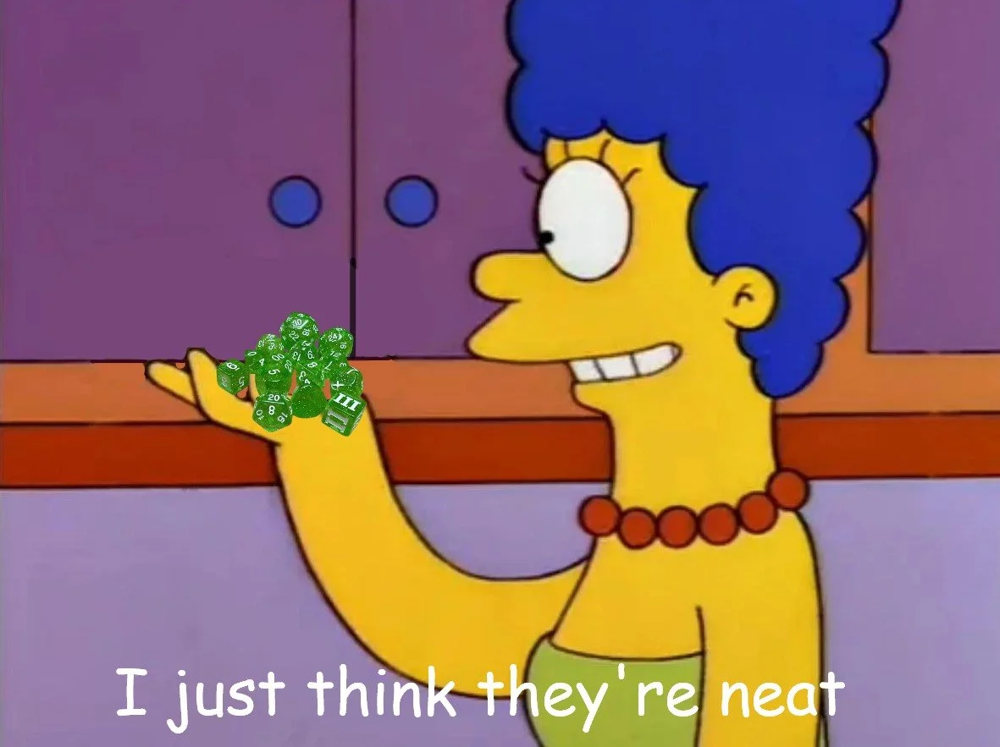
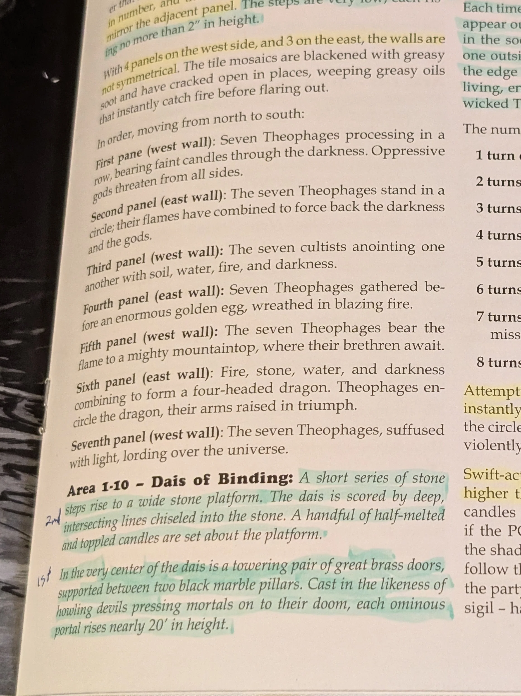
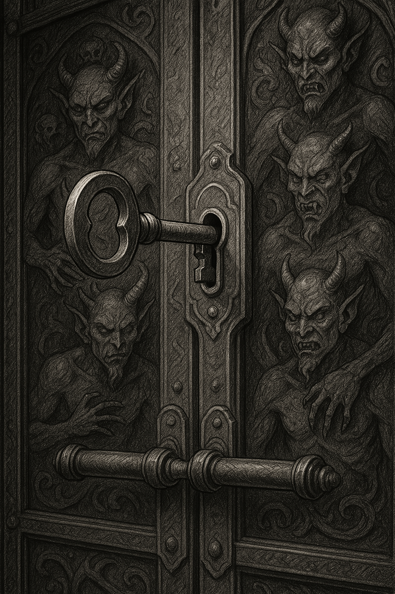
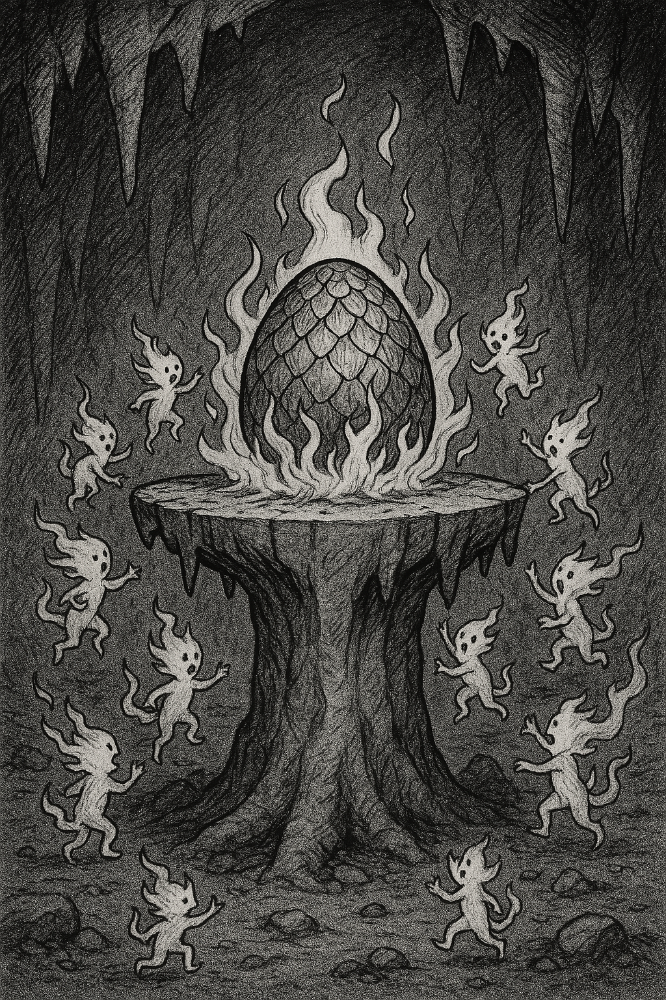

# RPGs at Awesome Con Part 2 - DCC & Con Thoughts

[rpg](/blog/category/rpg)[dcc](/blog/category/dcc)

Apr 17

Written By [Tim](/?author=631dce765850301d086426a2)

Picking up from [part one](/blog/running-rpgs-at-awesome-con-2025-part-1), this post takes a look at the third session of the con, DCC played on Sunday. At the bottom you'll find a few thoughts on the event overall.

### Dungeon Crawl Classics

DCC as it's known is a game that came out of D&D 3.5 and the Open Game License. As someone who cut my teeth on D&D 3rd edition in high school DCC feels very familiar in some ways, but it also makes some bold choices which make it a much more interesting game than 3.5. And I like it a lot for that. There are now countless retro-clones of D&D and I have no beef with them, but DCC sets out to be its own game and I think easily succeeds at that.

I'd break the appeal of DCC down into a few key categories:

#### Funky Dice

The most immediate thing someone will notice looking at a DCC game in progress is the huge number and variety of dice involved. A DCC dice set comes with 14 dice ranging from the D3 to the D30. These extra dice are used in a number of ways, most notably the "dice chain" where dice can be upgraded or downgraded say a D20 becoming a D16 or D24. And I think this is pretty cool, to be frank as a matter of game design I could take or leave it. But at the end of the day…

#### Tone and Adventure Modules

DCC intentionally takes a different tone from the Wizards of the Coast published editions of D&D. It aims to hue closer to many of the early D&D influences in terms of things like fiction and having some science-fantasy thrown in the mix. It puts [Appendix N](https://en.wikipedia.org/wiki/Appendix_N) sources front and center. And I like this a lot. Fantasy media has become a huge presence in modern pop culture, but in it's rise to prominence a lot of the weirdness of the genre has been lost. DCC's theme and adventures lean into the weird and dark and it's not the only kind of fantasy story I want to roleplay, but it's a great tool in your toolbelt. DCC numbers their adventures and as of this post they're on [#112](https://goodman-games.com/announcing-dcc-112-mother-of-monsters-crowdfunding-with-dungeon-denizens-2/). That's a lot of adventures! This doesn't even include Beneath the Well of Brass, the adventure I ran as that was a DCC Day adventure, rather than part of their main line.

DCC adventures may touch on science fantasy, darker themes than many D&D adventures, cosmic horror, or just have some weird stuff you'd be surprised to see from a more mainstream adventure. These adventures have been key to the game's success and their continued pace of releasing them shows this. Most are designed as one-off adventures, though Goodman Games has published some longer form campaign or mega-dungeon books.

#### The Funnel

Possibly the most important part of DCC's perennial appeal is the funnel system. A DCC campaign, or often a convention one-shot can start with a character funnel. In these players roll up or are given multiple level 0 characters. You may have a blacksmith, a shaman, or a [gong farmer](https://en.wikipedia.org/wiki/Gong_farmer). Armed with makeshift weapons this mob of peasants explore a dungeon and should any survive they may advance to the first level.

Funnels are a ton of fun, they offer an experience that is hard to replicate outside of this setting. First up you've got just a gang of peasants, fighting off kobolds with pitchforks and knives is a very different experience than a band of adventurers in chainmail with battle axes taking on the same kobolds. It also encourages the DM to kill Player Characters, and it encourages players do do things that might get their PC killed. Player death has been a fraught subject in RPGs as long as RPGs have existed. Player elimination in a cooperative game is a problem, and players grow attached to their characters. Most modern RPGs "solve" this by making it very hard for a character to die. Funnels solve this in another way, death is expected, and to some degree, encouraged.

The other thing that funnels do, that isn't intrinsic to the format but comes from the writers is they do an amazing job of having very low level characters interact with some very high level content. I'll talk about this more in the session/module recap below but these level 0 villagers saw some wild shit. And I love that. D&D has always been set up to allow this, but the default is that your high level character sees the crazy wild high level content. Many DCC funnels allow level 0 peasants to meaningfully interact with cosmic forces, and that's just fantastic content, pun intended.

#### Easy Onboarding from D&D

Far more than the other games I ran this weekend DCC is the perfect "off ramp" from playing 5E. The themes of the game are very similar, the mechanics are quite similar, and the way you as a player interact with the game and it's systems is quite similar. This isn't to say it's the same, skills are gone, feats are mostly gone. But the core of the game is the same and it's very easy to sit someone down who has only played D&D 5E and show thing this as a variant of D&D.

When you combine that ease of onboarding with the points above, I think it makes a great game for an event like Awesome Con where many or most of the RPG players will have only played 5E. You can show them something familiar, but meaningfully different, and in my humble opinion, more interesting.

### Beneath the Well of Brass

Spoilers if uh, you're reading this page.

I've not run [this adventure](https://goodman-games.com/store/product/dcc-day-2-beneath-the-well-of-brass-pdf/) before, like Glare Peak has a good reputation for convention games. Released in 2021 for [DCC Day](https://goodman-games.com/category/dcc-day/) it's a short adventure heavy on puzzles and light on combat.

Prep for this adventure was pretty simple. I know DCC but brushed up on the rules using it's quick start. That is a tip I have, if you're running a one-shot for a system you don't need to read or re-read a 200 page rulebook. Quick start rules are perfect for this kind of thing, yes, there are some things they won't cover. However my strong advice for any of that is to just wing it. You should never need to open a 200 page rulebook at the table for a one-shot. Have a quick-start, have rules references, or wing it.

As part of prep I have become a convert to the highlighter. I know that some folks won't want to mark up a book they paid money for, but I think it's really effective in both learning what you're reading, and making it easier to reference. Let's take a look at a page from this adventure I marked up in this way on the right.

Note the two colors, this is intentional. I used yellow to highlight important DM-facing information, and green to highlight player-facing information like descriptions. Even a short adventure like this has thousands of words and you're not able to read all of them while at the table. Highlighting these important chunks makes referencing the book at the table much easier.

I don't do this with the intention that I'll re-read all highlighted sections at the table, but if I need to reference something this makes finding it faster.

If you have a tablet you can do this for PDFs also which I did for Glare Peak.

### The Session

As with other sessions the signup sheet was something of a lie, 5 players signed up, 4 showed up but one brought someone with them so we had 5 which was a good party size, I think this adventure would scale up or down quite well. Beneath the Well of Brass starts in a town occupied by a cruel bandit lord, the Black King. The player characters are dragged out of their homes and to the Devil's Maw where they must descend the Well of Brass and find the secret to eternal life, or die trying. Players were generally familiar with D&D but not DCC and so I walked them through the key differences, mainly that this was a funnel adventure where they'd play a number of 0 level characters.

The players had shown up with their own dice but I explained they'd need a few more shapes and let them pick from my too large collection of DCC sets. I think one downside to games with unusual dice needs (see: everything I ran this weekend) is that they don't let pick-up players use their own, preferred dice. But I think in cases like this if you can offer players a number of options it mitigates that issue. Or that might just be me trying to explain away owning $200 of DCC dice.

#### **SPOILERS FOR THE ADVENTURE MODULE**

I distributed 3 characters to each player (15 in total) and they got going. The first very part of the dungeon brings me to my first issue with the adventure as written. Players witness a fireball exploring from the depths of the well. This is gas that builds up (okay) and then ignites (huh?) and the players are supposed to leave something burning in the room where the gas builds up to prevent further explosions. My players picked up on a lot of this, but not that leaving something burning in this room would prevent a future explosion, because well, that doesn't make a ton of sense. As written the explosion will impact much of the adventure's map, rather than having everyone make an agility saving throw or most likely die, I was content to let the gas and explosions just be a cool bit of flavor, not a death trap.

The players then investigated an optional area of the adventure, a small chamber inhabited by fire elementals, hostile if the players bypass them, but easily distracted by fire burning on their makeshift alter. One of the player's characters was the local shaman, he hopped up on the alter and started burning herbs and dancing. He then dropped a burning torch on the alter as the fire elementals congregated. I asked for a saving throw to avoid being caught on fire and we had our first party death, 10/10 no notes. I got to bust out my [Cause of Death stamp](https://www.weird.works/peculiar-products/official-cause-of-death) which is always popular and one of the reasons I love DCC funnels.

Made with the forbidden technology (ChatGPT) what the doors may look like. For the key (heh) puzzle of the adventure it has no art of the door or key.

With a corpse now burning on the alter I figured the fire elementals were well and truly sated. The players went to the underground lake with a cursed sword next, one character died trying to pick it up and the rest left the area quickly. Overall I like this small side area of the adventure, it's entirely optional but it's interesting, and in fact proved hugely important to the rest of the adventure. One thing I did realize during this is the room works a lot better if items placed on the alter catch on fire magically, rather than needing to be lit. So I went with that when players returned, though running this again I'd just have the fire spirits do it.

After this small side quest the players reached the meat of the adventure, a series of clues leading up to doors to the elemental plane of fire. The first of these is a prayer wheel and I encountered the second bit of the adventure that I don't think mechanically hangs together. Players can spin the prayer wheel and get a random effect. If a character spins it more than 8 times they might die. The problem is we had 13 (living) characters and who wants a player to roll this thing 8 times with one PC? So I just made it that spinning it more than 7 times in total would cause the death checks to start. And that worked fine, the adventure gives you descriptions of the prayer wheel patterns and I loved that my players took notes on them.

The next room is a long hallway with 7 sets of stairs and 7 images. Again, the player stook notes on the descriptions from the adventure. And I like what this hallway depicts. However as I was giving the descriptions and players were talking about them it seemed clear we were headed toward a problem. The players were taking a very literal approach to everything they saw depicted. One panel shows a four headed dragon being born, something not at all part of the adventure. But the players attempted to recreate things as precisely as they could, which didn't really line up with the adventure's most important puzzle. And this is something I should have tried to adjust for, but I think is partly a failing of the module. The players paid very close attention and were not rewarded, but were in fact punished. They spent a good deal of time and effort to complete a ritual from one of the panels that was entirely unnecessary.

So, let's talk about that important puzzle. The final room of the dungeon has a large set of brass doors, surrounded by 7 candles. The players are to light the candles, then turn the key in the doors 7 times before opening it. Each time they turn the key phantom wraiths appear outside the candle's protection and if they try to open the door too soon or too later they will attack. And the party got well and truly stuck on this puzzle. I tried to signpost things by playing up the turning of the key, it giving an audible click at the end of a cycle, and not allowing them to turn the key backwards. Most frustrating to me fairly early on one player say "maybe we have to turn it more times" and a bit later another player said "maybe we have to turn it 7 times" but it'd be another 10 minutes before they tried that. And some of this was based on the players, the most alpha of the players (who had roleplayed the shaman to his death, he was great!) was stuck on recreating scenes from the panels. While the other players threw out ideas but didn't put them into action.

I felt a little helpless during some of this, my hints were not being picked up, and the party had come up with the solution but not tried it. And I'm not sure what I should have done differently. I think prodding them to talk less and try more would have been good, but there were dangerous stakes in the game so I understand wanting to talk it out and not just try things.

Made with the forbidden technology (ChatGPT) this is basically the character's hopes of beating the adventure successfully going up in flames.

Eventually they got through to the plane of fire and the palace the portal deposited them in. In the treasure room they found the phoenix egg, shown in previous panels and clearly the answer to eternal life. However they thought this was the next part of the puzzle or ritual. Rather than bringing it back to the bandit king, or discussing what else to do with it, they quickly agreed to place it on the alter of the fire elementals. So back they went, and having no reason to interrupt this I left them place it on the alter and had it burst into flames. In the adventure module if the players deliver it to the bandit king he will set it and himself in a pyre, where the egg will turn him back to a young man, then child, then infant, then nothingness. In this situation I had the fire elementals crowd around it, where they were reborn as a single blue flame. The players picked this up in a lantern and carried it for the rest of the game.;

But the players could no longer accomplish what the king set out for them, and so they returned, planning to convince the king to come down and lead him into an ambush. It was a clever plan but I felt they're need to work to convince the bandits. I had them do some rolls and it ended up with a handful of the bandit king's guards following them down into the dungeon to scope the ritual out. There they showed the guards the evil sword in the lake. Their leader reached for it and… rolled a natural 20 to resist the damage. At this point I threw out my previous plans and had these bandits return to the surface. The bandit with the evil sword told the bandit king to come down and I rolled for the king to see if he noticed something wrong. And he… rolled a natural 20. I had him cut down his man there and take up the evil sword. He then charged at the PCs and he…. rolled a natural 1. I let the PCs escape back to the dungeon (they'd found another way out) but made clear that the bandit king was going to make good on his promise to slaughter the village. From their escape route I let them rush to the village to tell everyone to scatter, and that is where we ended. The party and their village had not died, but hostages had, and they'd not accomplished much but giving a very evil man a very evil sword.

So, what do I think about Beneath the Well of Brass? It's a mixed bag, there is a ton of cool stuff that happened in this adventure, and I love that it could run with zero combat. But I think it's got some weird mechanical issues. Puzzle-based RPGs need to have tight puzzles, players should not be punished for paying close attention. And if the key to a puzzle is… a key, it should feature in the hints about the puzzle.

I'd consider running this again but would want to make some heavy edits. I think the panels need to reference the key, it's core to the puzzle and having it seem like an afterthought I think lead to a lot of the issues. I'd also consider how I'd handle another group recreating the rituals seen on the panel, maybe I do let them summon a 4-headed dragon, that'd be a very cool alternative end to the module.

#### **SPOILERS END HERE**

### Awesome Con and Con Gaming

Awesome Con was pretty good, I didn't spend a ton of time exploring the con outside of my sessions but I walked around the vendor hall and checked some stuff out. They have a lot of programing and I ended up not going to any panels. Scheduling was a little awkward with my games but mostly I was too lazy to deal with reading through the very full calendar. The location is great, food isn't cheap around the convention center but there are some great restaurants though I mostly went to [Love, Makoto](https://www.lovemakoto.com/) and [La Colome](https://www.lacolombe.com/pages/cafes/blagden) both of which I certainly recommend. Labyrinth did a great job organizing and running events. The number of no-shows was annoying if not entirely surprising. I'm not sure what could be done here, in a perfect world I think sending folks a text in the morning and an hour out from the game would be great, but that needs a system to support it, it'd be too much manual work. I bet that if some of these no-shows had canceled some people could have been found to fill spots. Next time I'll know to put the cap 1 or 2 higher than I want, and hope it balances out.

These were also the first time I'd run this many sessions for strangers. And that went well, all the players were very cool and chill, the space was a bit louder than I'd like but worked well. I was very pleased that there was solid participation in non-D&D games. I think three sessions in a weekend was about my limit, in some ways I'd like to have had 2 sessions on one day, but having them spread out does make things easier. I'm not the type of GM who wants to run 3 sessions of the same system in a weekend, but going from 2 to 3 would probably also help with my mental load/prep.  
  
I love that 5E has introduced so many people to the hobby but it can frustrating how many of these new players are uninterested in trying out the wider world of RPGs. I hope my sessions this weekend broadened some horizons and the growth of the hobby and it's increasing diversity are great to see.

[convention](/blog/tag/convention)[rpg](/blog/tag/rpg)[dcc](/blog/tag/dcc)
