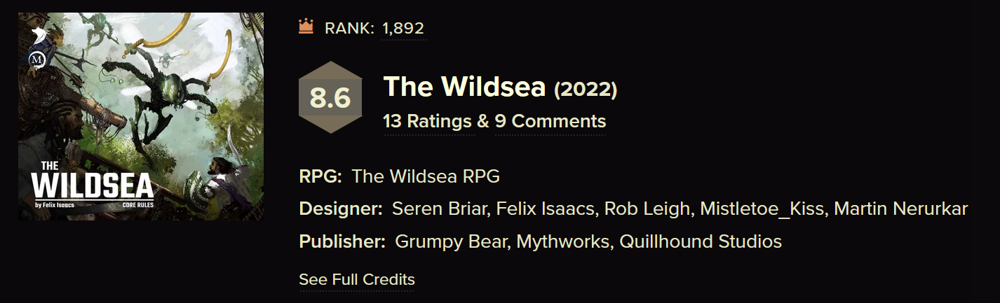

# What Should RPG Reviews Be?

[rpg](/blog/category/rpg)

Sep 4

Written By [Tim](/?author=631dce765850301d086426a2)

The subject of RPG reviews can be a big contentious. Most RPG reviews come from a big channel or website where they will review a steady stream of products. Implicit in these reviews is the fact that the author of the review has not played the game or module in question. And how can they? Someone posting a video or written review per week doesn't have time to do a new system or run through a new module each week.

# The Play's The Thing

I think some of this discussion as kicked into high gear with the launch of the excellent Quinn's Quest. The channel boasts editing and scripts well beyond most RPG reviews, but makes it clear that each review is based on playing a campaign on the game in question. And the result is fantastic, there are not many of them, the production values would make that hard but the need to actually play multiple sessions of these games really dictates the schedule.

And I think it's worth addressing something else here. Quinns can't answer the question "will you like this RPG?" His Vaesen and Wildsea reviews come up often on Reddit because a lot of people disagree with them. If you look at [the reaction to his Vaesen review](https://www.reddit.com/r/rpg/comments/1cxzbiw/quinns_quest_reviews_vaesen/), much of it was people who enjoy Vaesen or the Year Zero Engine pointing out what they enjoy about it and where they think Quinns got it wrong. Meanwhile, most discussions of Wildsea seem to include at least one person mentioning how excited his review made them for the game, only to be disappointed when they played it.

And that's the nature of reviews, art and RPGs. This is all subjective and your tastes and the reviewer's tastes may not line up. Or they may line up but your groups have a different vibe and one clicks with a game when the other doesn't. RPGs are an inherently social experience which makes this disconnect bigger than with most games and art. Not only do you have to click with a reviewer, your table needs to line up with theirs to have an experience that is at all similar.

So you can watch Quinn review Slugblaster and think it sounds like the best game in the world, but get it to your table and it lands with a thud. It turns out you're just on different wavelengths. So if you want a second opinion on a game from someone else before buying it, you may not have another option from someone with actual play experience.

The majority of reviews are someone talking to a camera, or writing on their blog about a book they read, perhaps closely, perhaps skimming some sections. And that obviously has some huge drawbacks. A system that reads great might run into problems in play. Or a table might not click with the mechanics of a game after loving the sound of its theme.

# A Lack of Quantity

Wildsea on RPG Geek

With things like films or video games sites like Rotten Tomatoes, Metacritic, Letterboxd, or even Steam have grown up to try and give a meta-score or crowdsource reviewing wisdom. And these have had no small amount of success. However all depend on critical mass which just doesn't exist for RPGs. Let's take Wildsea, it's not sold on DrivethroughRPG, the largest PDF store for RPGs and a place we often see reviews. It's also not sold on Amazon, the world's largest storefront and another source of reviews. It is sold on Itch.io, which allows comments but does not have reviews, [those comments](https://felixisaacs.itch.io/thewildsea) are mostly folks reporting technical issues with their PDFs, not exactly helpful to a potential customer. We finally find something approaching meta-review on [RPG Geek](https://rpggeek.com/rpgitem/370110/the-wildsea), a site where 13 people have rated the game and two have left comments on the substance of the game.

None of the above is to say that meta-review sites are entirely a good thing, we see issues with review bombing, overly positive press reviews, and no way to account for the artistic value of a critique itself. But it is useful to be able to look at a movie on RT and see it has 92% positive ratings, or a game on steam and see it's Mostly Negative. We don't have that for RPGs, the closest we can get is big titles on Amazon and frankly it's near useless. Spelljammer: Adventures in Space for 5th Edition has been [widely](https://gamingtrend.com/feature/reviews/spelljammer-adventures-in-space-review-promised-a-feast-got-a-morsel/) [panned](https://geektogeekmedia.com/geekery/tabletop-gaming/spelljammer-dnd-5e-review/) as a terrible boxed set. However on Amazon we see it sitting at 4.6/5 stars from over 4,149 people. Meanwhile the widely praised Curse of Strahd supplement is sitting at 4.9/5 stars from 7,735 reviews. Is the Ravenloft product slightly better than Spelljammer? Are they both great books? If Spelljammer, a product that has people saying "I can't wait to be done with Spelljammer so I can run something with more substance and bite." gets 4.6/5 stars, can we use Amazon reviews to judge RPGs?

Everything I've mentioned so far is a pretty popular product, selling far better than your average RPG supplement which is just on DriveThroughRPG and might have a single review, likely from the author's friend. There are plenty of RPGs products where I've looked for a review and came up blank. The fact of the matter is we exist in a niche hobby, and anything that isn't D&D is a niche within a niche.

So what we are often left with are the reviews frequently criticized for the author's lack of hands-on experience and for most RPG products those are quite scarce. And this isn't a problem easily solved.

# Where Do You Even Find Reviews?

Another big problem is finding reviews. If you like video games you know that you can go on Metacritic or Open Critic and find plenty of reviews. Or if you're a big fan of IGN or Rock Paper Shotgun you may go to them for all your reviews, and if there is a big new game, they'll have one. Likewise most of the big video game review channels on YouTube will cover any major new release.

The RPG market isn't quite like that, there are very few dedicated RPG news sites and [RPG.net](https://www.rpg.net/) is the only one I know with consistent reviews. Most written reviews appear on blogs such as this, and may show up when you Google, but that's the best you got. There are also plenty of RPG review channels. And odds are, if there is a hot new RPG you'll probably find it reviewed on one of the bigger blogs or one of the channels with a lot of reviews. But this is far from consistent. Adding to the problem is there is no way to easily sort between "I read the PDF of this" and "I ran this for a 30 session campaign" reviews.

And this isn't really a problem reviewers can solve. What I do recommend to reviewers is to broadly spread their reviews. If you spend the time to write a review for your blog, take the time to format it for and post it on Reddit, Amazon, RPG Geek, DriveThroughRPG, etc.

# How To Improve The Situation

#### 1. Play Games!

I'm as guilty as anyone of having RPG books on the shelf I've never played. And the solution to that is to play more games. If your current group doesn't want to try something else look for friends online who might want to play, or check out local RPG groups on Facebook to see if you can find players for something exciting you.

#### 2. Review Games and Supplements

I know the average person reading this has a library full of PDFs on DriveThruRPG. How many have you reviewed? It doesn't need to be long, but taking the time to say what you think about a product will help others down the road when they're considering it. If you like it say what worked, if there are problems with a product, point them out.

#### 3. Disclose Your Play

I will start every review with a disclosure on what I've played of the game. This is really important, if someone says a system was great for a 30 session campaign I'm going to take the review with a grain of salt if I'm looking at it for a one shot. If someone hasn't played it, I'll still read the review, but I'll know that it's addressing how the book is written and laid out, not how the game fairs in play. This type of disclosure is also great to update if you've played more of a game. Go back to an old review and add a note that after a 2 year campaign you still love the system.

#### 4. Cross-post Your Reviews

Once you've written them it doesn't take much time to post your thoughts on a game across a few different platforms. Even if you do video reviews I'm sure after a 30 minute video you can pretty quickly write a couple paragraphs for an Amazon review. Most people are not going to look very hard for a review so try and meet them where they are.

# Appendix - Where To Post Reviews

1. Your blog - For written content this is your home base
2. YouTube - For video content this is your home base, you can of course post clips of them on other platforms
3. RPGGeek - I wish this site got the traffic BGG did but it's what we have so work with it. More reviews there will help it get more traffic. You're welcome to link to your blog from there, or add a video review to the videos section of an RPG.
4. Reddit - Reddit can be a little tricky, subreddits have particular rules on self-promotion and anyone posting weekly reviews of RPGs they read probably doesn't want to try and post all of them to Reddit. However if you have something to say about a game posting it to /r/rpg, /r/osr, etc may be worth it. What I do is post a text-only version there, and spend a little time making sure the formatting is okay, but link to my blog at the top if someone wants to view an easier to digest version. If you're not willing to spend some time on this, and reading the subreddit rules it's best to skip.
5. DriveThruRPG - Here again you can link to a blog or video in your review, so feel free to do that, but also include something worthwhile for anyone staying on that site. A big downside here is that you can only review things you own on DTRPG, and it's a site (mostly) selling PDFs so I'd not focus on the physical book there. Another limitation is not all RPGs are on here.
6. Amazon - It'd be best if we didn't buy any RPGs on Amazon but the fact of the matter is I buy some there and plenty of people buy them exclusively from Amazon, they move a lot of books. Which means it's a great place to get eyes on reviews. You can't link to your blog/channel there but if you have a review that can be posted there you can always include the name of your blog or channel in the review. A limitation with Amazon is that many indie games are not sold here.

I'm intentionally not listing forums here. There are still active RPG forums but I just find it's so hard to get visibility on them as they are all self-contained environments. If you use a forum post away, but unfortunately I don't think they're the best route to take in 2025.

####

[rpg](/blog/tag/rpg)[review](/blog/tag/review)[meta](/blog/tag/meta)
