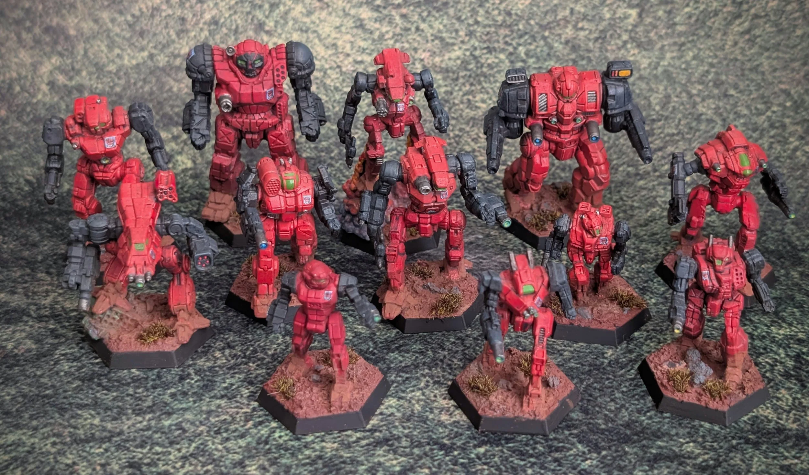
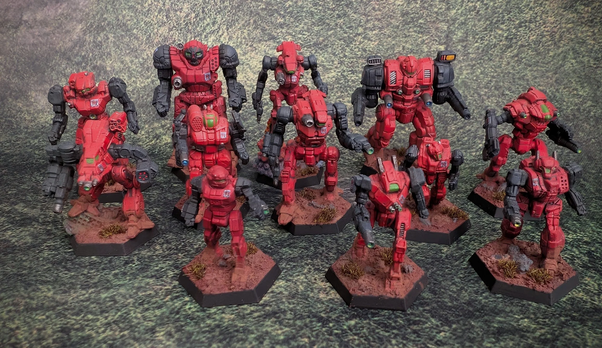
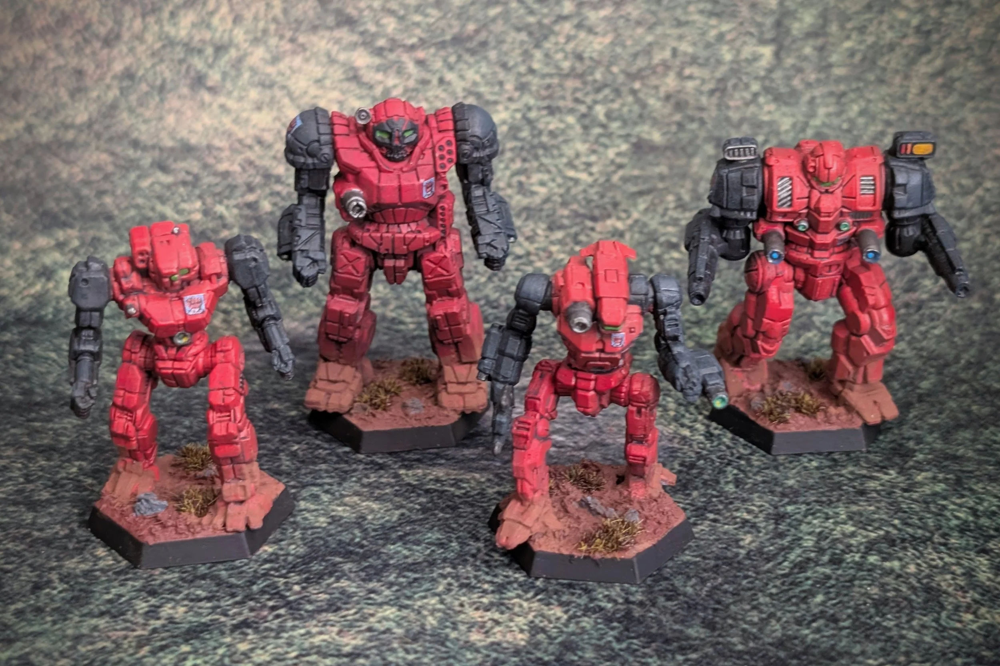
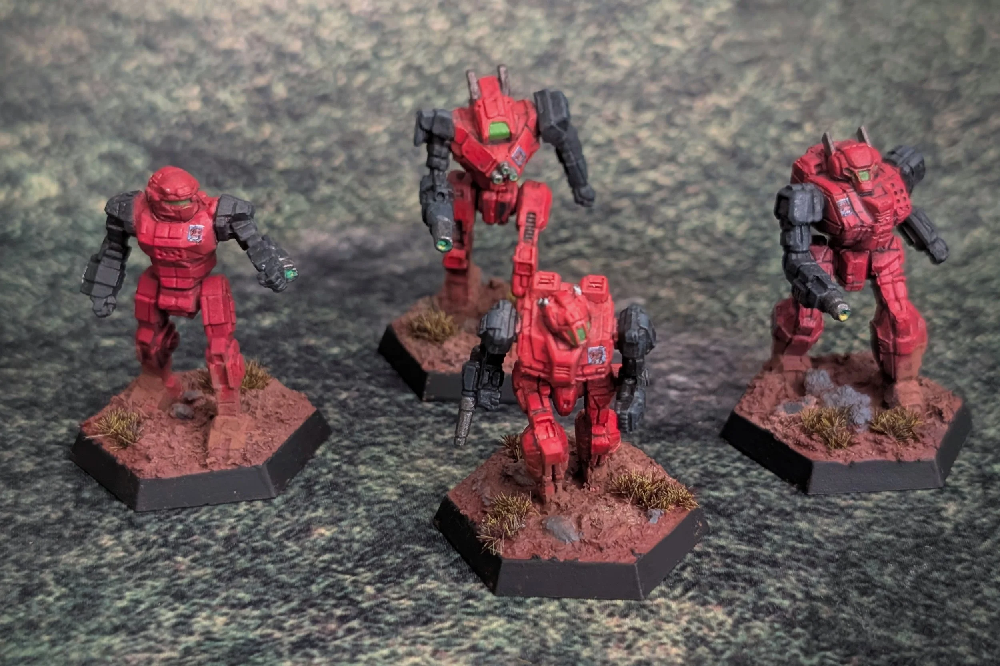
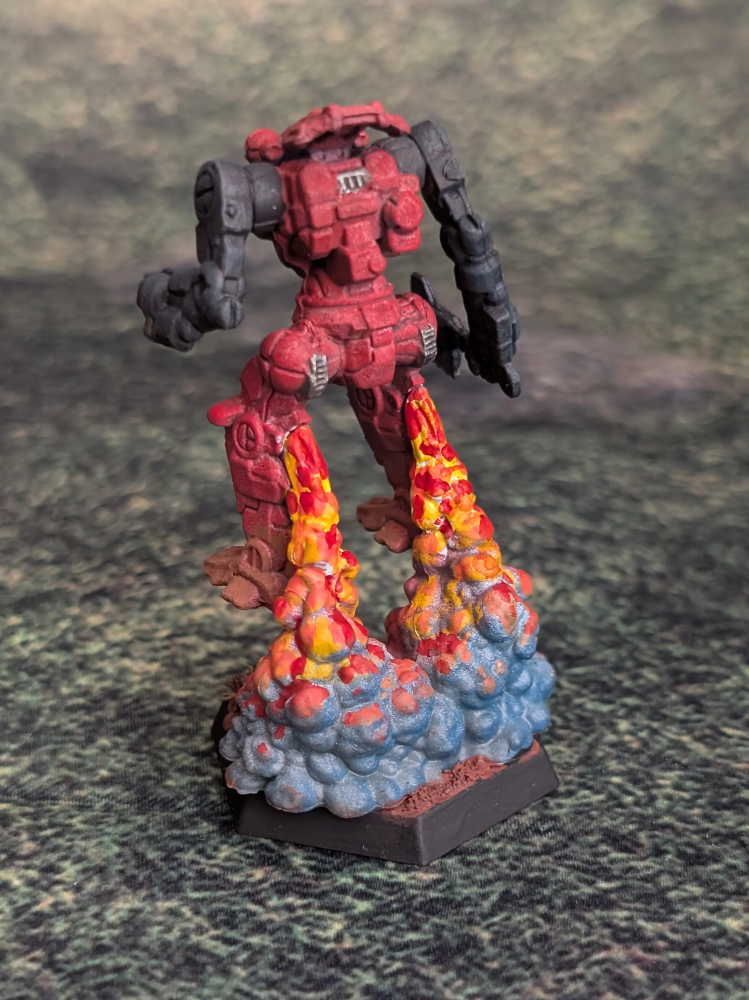
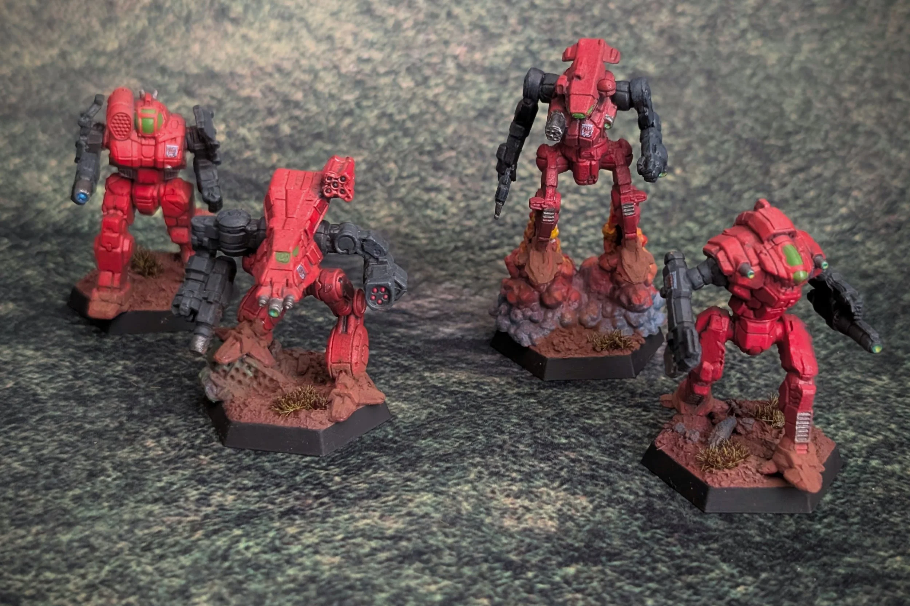

## **10TH SKYE RANGERS LYRAN ALLIANCE c. 3058**

**Competed 9/13/2025  
Catalysts Miniatures  
Paints used:**  
**Pro Acryl:** Coal Black, Bold Pyrrole Red, Red Oxide, Orange Red, Orange Yellow, Deep Blue, Sky Blue, Dark Emerald, Jade, Green, Golden Yellow  
**Vallejo:** White Ink, Xpress Color Plasma Red 72.406, Metal Color Jet Exhaust  
**Oils:** Abteilung 502

The [10th Skye Rangers](https://www.sarna.net/wiki/10th_Skye_Rangers) were part of the Lyran Armed forces. I was drawn to them for a few reasons. First, they were part of the Free Skye Movement and I like that part of Battletech history, having some units that can fight on both sides of the conflict would be fun. Second, they were on Coventry for the battle there in 3058, this is another historical conflict I'd like to be able to recreate so want a number of units that were there. Third, they were destroyed on Coventry and not rebuilt. And I think that's neat, Battletech units that cease to exist are not uncommon, but it's not what you see from the most popular units. Lastly, I wanted to paint some red mechs and well, these are some very red mechs.

I did play a bit fast and loose with the mechs here, the 10th would not have been supplied with mechs like the Devastator or Nightsky, with those reserved for more reliable units. However I like a lot of the late-clan-invasion designs and have plenty of the minis to use so I added them in here.

**RECON LANCE:** COM-5S Commando; WLF-2 Wolfhound; VLK-QD Valkyrie; LocustLCT-3S

**BATTLE LANCE:** NGS-4S Nightsky; BSW-X1 Bushwacker; HCT-5S Hatchetman; GRF-3M Griffin

**HEAVY BATTLE LANCE:** AS7-S Atlas; DVS-2 Devastator; AXM-1N Axman; GHR-5N Grasshopper

[Previous

Previous

## 3rd Royal Guards](/battletech/3rd-royal-guards)
[Next

Next

## 15th Marik Militia](/battletech/15th-marik-militia-free-worlds-league-c-3007)
