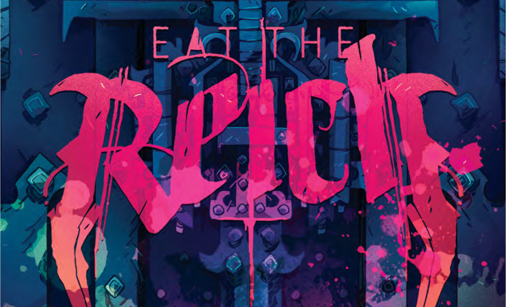
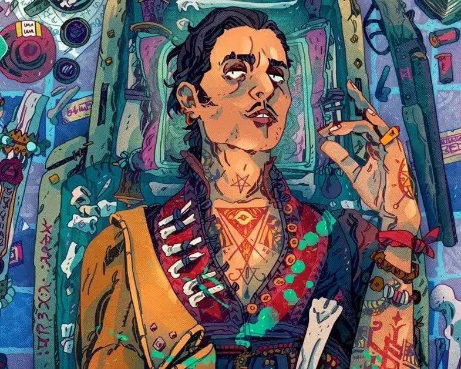
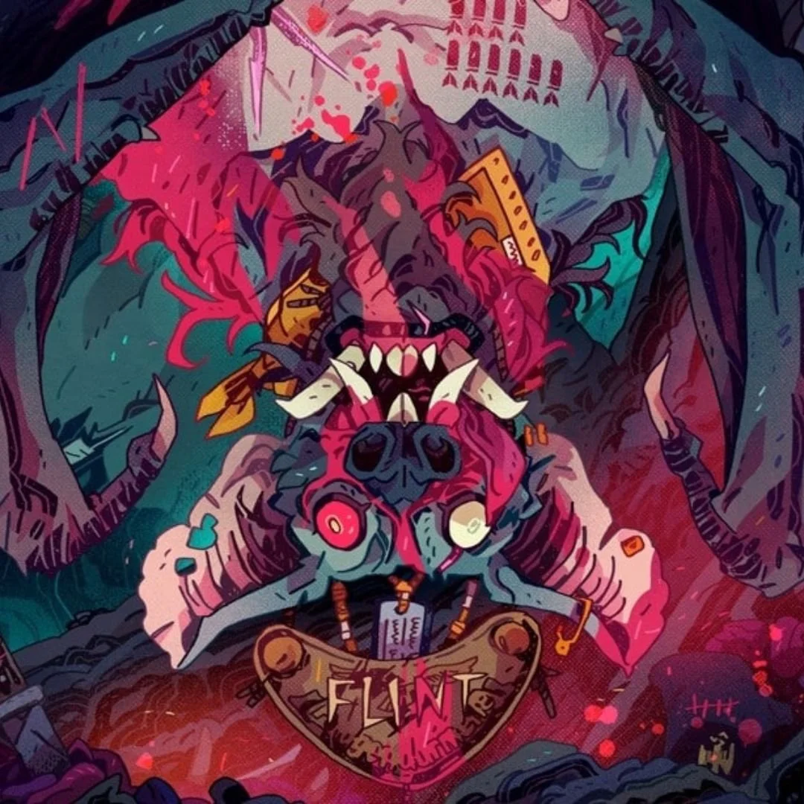
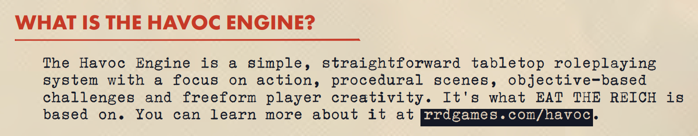
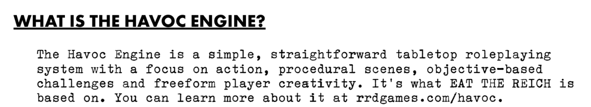
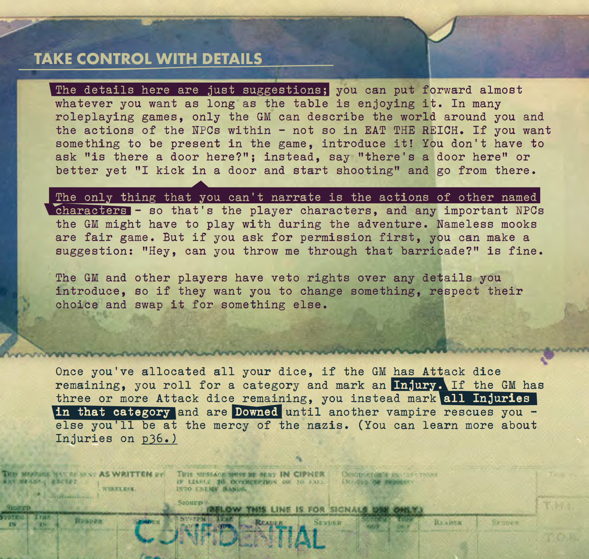
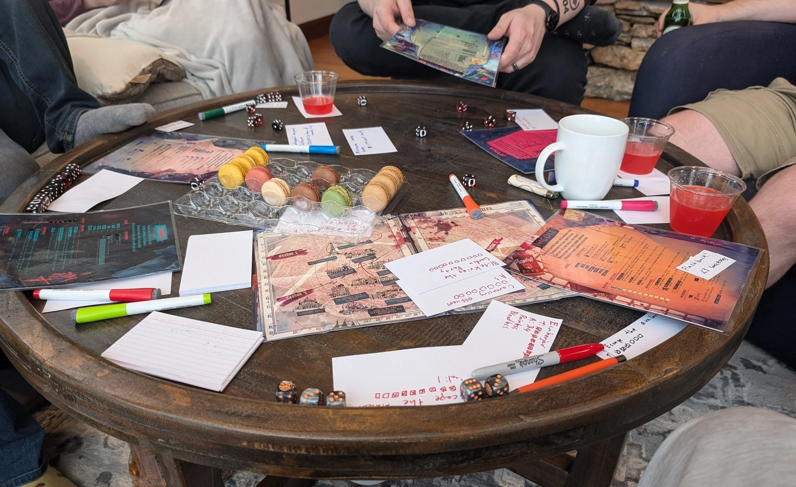
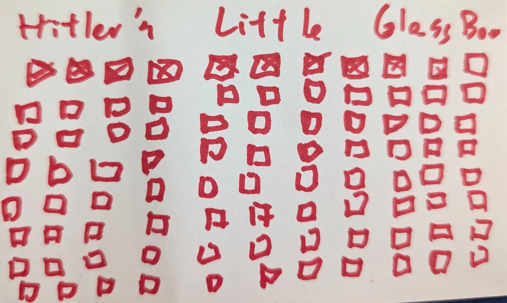

Written by [Grant Howitt](https://x.com/gshowitt)   
Art by [Will Kirkby](https://www.instagram.com/chamonkee/?hl=en)

Published by [Rowan Rook and Decard](https://rowanrookanddecard.com/product-category/game-systems/eat-the-reich/?v=0b3b97fa6688)  
$29.99 Softcover  
$15.00 PDF

## Introduction

I've run ETR one time¹, we did the entire thing in one day which isn't recommended but I thought it worked out fine. We had all day at a rented house so took our time, starting a bit after 1pm and finishing up around dinner, with breaks aplenty. This was my first time running or playing the HAVOC system and I'd played RPGs with the six players before.

First, I'll talk about the rules and the book, then a session report, and finally my conclusions. I'll note that this review will certainly get some things wrong about the game or the book, I didn't re-read the rulebook after playing which I do sometimes and always shows you things you got wrong or mistakes you made. If I did get something wrong please feel free to reach out and let me know.

1. *Update: September 2025  
   I ran ETR a second time this spring as a convention game. This was a table of 5 players and we ran through it in a 3 hour convention time slot. I thought this worked very well. You do need to be on the ball to do this. As a GM I'm pretty ruthless about moving the party forward, if your tables tend toward less structure I'd not recommend doing this in less than 4 hours.*

# Part 1: Mechanics

The game is based on the [HAVOC system](https://www.drivethrurpg.com/en/product/444715/havoc-the-fast-d6-rpg). I've not played the system before and I was quite impressed. To briefly describe ETR's mechanics: each player turn that player picks a skill to use. They can also use a piece of equipment and an ability in conjunction with that skill. They then build a dice pool based on the skill in question and adding one for using an item and one for using an ability. They then roll that dice pool with 4-5 being a success and 6 being a critical. The GM simultaneously rolls for the attack value of enemies the party is currently facing. The GM has success on rolls of 4-6 and no crits. The player then spends each die and describes an action each time. Dice can be spent on negating the GM's successes, attacking the active opponent, or advancing the objective in the current location. They might remove a die saying they scramble up the side of a building away from the German patrol advancing the "Get Across the Courtyard" objective. The next die might be spent to shoot at that same patrol. When doing the second action the player notes that their rifle has "+ Elevated position" this means when they use it from an elevated position they can roll another die right away, and if it's a success they can use it as one of their actions this turn. At the end of the turn if there are GM dice left over the player will take an injury.

In short, I loved this system. It encourages player creativity, forces players to build a narrative on their turn, and handles the GM's actions very well. This isn't a game where the GM rolls no dice, but the GM's dice are fairly passive and evenly distributed throughout the turn. The players have to adapt and respond to the GM's rolls in real time, rather than taking a big hit out of nowhere. The other great part of how this dice system works is that by rolling for successes before describing what you do players are given full narrative control over what their action is. One thing I really hate in actual play podcasts is hearing a player say "I shoot at him in the face" and the GM saying "are you taking the -4 penalty to aim at the face?" It's not the player's fault, or the GM's fault, it's the game's fault. Moving the roll ahead of the narration is a fantastic move.

Next I want to highlight the game's use of flashbacks. This isn't the first game to use them but I really like how it does. Once per session if a player rolls and gets <2 successes they are able to declare a flashback. Then should then describe a similar situation that has happened before with another character. After this they get to add 2 dice to their pool and reroll. This is a great mechanic and gives players an expendable resource to get out of a tough spot. But like much of this game there is a focus on narrative.

> Our first player flashback was used in our second scene. The players had arrived at a graveyard intent on disrupting a Nazi funeral. Cosgrave used his once per game item, a jar of lost souls to get a huge pool of dice. Which he rolled… and nothing. He had 1 or 2 successes on something like 7 dice. So he declared a flashback and frankly I don't remember what it was about but it started with "so the last time I ruined a funeral…" And that's really all I needed to love that scene. Cosgrave, serial funeral ruiner.

Lastly I should address the unusual structure of this product. Eat the Reich isn't really a system, and it isn't really a campaign, it's designed to be played as a two-shot with pre-generated characters telling one very specific story, parachuting into an alternate history Nazi occupied Paris to drink all of Hitler's blood. And it does a great job at this very specific goal. But it's not designed for campaign play or bringing your own PC. It includes rules for character generation and ideas for other one/two-shots to run, but know what you're getting.

## The Book, Artwork, and Feel of the Thing

In a word, fantastic. Eat the Reich has a fairly short, small book but it's a work of art. From the cut-out cover to the bright pink page edges you know you're getting something special. Throughout the book there is evocative, fantastic art that sets the stage for the world and characters. The player character art in particular is outstanding end evoke a strong sense of personality at a glance.

There is an optional pack sold that includes character sheets and maps printed out. You get a couple copies of each and it's not essential but I'd recommend it, they look and feel better than printouts would. Of course for online play they're not needed.

> If I had to pick a favorite character it would be Flynt. Flynt is a giant bat and the game leaves it up to Flynt's player to decide how verbal he is. Our Flynt said one word in character all game which was his name during introductions. And I loved that. Sometimes you just want to be a big bat and fuck up some Nazis.

The PDF is well done, it has both hyperlinks and an index. On the accessibility front they provide a PDF in plain text which is greatly appreciated. I have dyslexia and this makes it far easier to read. The text in general is high contrast and I can and did read the book, it's not as bad as Morkborg in that regard, but when looking at the PDF the plain text was far better.

## The Play

I think the games flows very well. Player turns are longer than in most games but they can be more engaging to follow as several things are happening. And the rules are simple enough that player turns are much more action than thinking or rules questions.

Playing the game is about going through a series of locations each location with an objective to advance the party through the location and through occupied Paris. The locations are great with a good variety of places, tropes, and threats for the party to face.

I also want to commend Howitt for adding in a system by which players can advance their power. This isn't for campaigns and having a system to offer player advancement in what is effectively a one-shot is always tricky. The advance system happens after players defeat a mini boss Ubermenchen and most give the players more options, not more raw power.

## The Problems

The rulebook does have a few issues. It's well written and well laid out, but the layout of the book does harm usability to some degree. A very important rule is tucked in the bottom of this page, and it's something I forgot and missed during this playthrough.

It's that "three or more" rule, which is very important, but again kind of tucked away there. And it's needed to keep threat on the players who otherwise can ignore GM successes to take an injury.

So, let's talk difficulty. The game is unusual in that it is explicitly designed for the players to win. And that's distinct from something like 5E D&D's "it's hard for players to die" this game has a win state and the rules say the players should reach it. Which I think makes sense and works well for the vibe of the game. But it does sometimes feel like it's a bit too easy.

I do recommend [ReVamped](https://geckopirate.itch.io/revamped), a fan supplement with some rules that help in this regard. And the GM will need to play with enemy stats and spawns. If the players are cruising just add an attack point to enemies in the next scene, it's very flexible in that regard. My one balance concern is Sniper squads, their attack dice are far beyond other grunts and one location having two of them is a major problem.

# Part 2: Our Session

***This section has spoilers, skip to Part 3: Conclusion if you don't want them.***

## The Party and Introducing the Game

We had six players which is more than I'm used to and a cause of some concern. It ended up working pretty well though I think 4-5 players would be the sweet spot for this game. We went clockwise around the table and kept order consistent between locations which kept things moving. The rulebook recommended players select their drop location but I wanted to start with a cold open so I narrated their drop coffin arrival which I really liked and the players enjoyed.

The rulebook doesn't offer a lot of advice on teaching players the game so I decided to do a short flashback using one of the characters and walk through a couple turns of how to use the dice pool system. I walked the one player through a few rounds of combat as they skied down a mountain attempting to escape Nazis. I think this worked pretty well and I preferred it to just reading through the rules and it also let me give a play example of how players should approach the game. It also helped to reinforce that flashbacks are important to the game.

Players were given a laminated character sheet and a dry erase marker. I used index cards to keep track of objectives and enemies. Both worked well, I think running this in person without index cards would be a mistake.

## The Game

The book recommends letting players pick their first location but I didn't want to do that. This was for two reasons, first I didn't want any kind of discussion among the party before getting into the game, party decision making can bog down games and I wanted to limit that here, especially at the start. So for that location I picked the hotel bar occupied by Nazi officers in a very tall building. This allowed for a great intro as their drop coffins crashed into the piano, a Nazi sitting at the bar, etc. The first scene was a little slow but players got to grips with the game during it. I used another flashback after they landed to go back to the plane before they dropped to give them their mission briefing. This let the action start without exposition, and offered another reminder about flashbacks. I highly recommend it.

The book doesn't offer a lot of guidance for how to set the path, so I typically would give players a couple of options that I'd give a vague description of, and the party often had a pretty strong preference for one. This would limit discussion and also let me pick out the locations that were more interesting to me. And it worked well, it started with them looking down from the hotel bar and seeing a few things, but as soon as I mentioned a church with what looked to be a Nazi funeral going on the players immediately shouted that they wanted to go there.

That lead to the "so the last time I ruined a funeral" flashback mentioned above and I was really struck at how well the game's systems were working less than an hour into playing. Cosgrave had not only used a single use ability, but he'd also had a big failure, but been able to recover with a flashback. Getting players to use up limited use abilities/items in RPGs can always be a struggle so this set a really nice tone for the rest of the game with players going for broke.  
  
I'll skip most of the middle sections, they all went well and the book does a fantastic job of offering exciting things to find in each location. One thing I noticed is that the players never used the scrounging rules. They were happy to loot some of the bespoke things, but they never took the chance to loot a miscellaneous gun or the like, I mentioned these rules several times but no one used them. Again, I think this speaks well to the system, players wanted to move the action forward, not check lockers. The players did delight in many of the bespoke equipment that could be found with Napoleon's undead horse being a particular favorite of mine.

Our session went well, we took a pretty long break at one point but then got back together to finish up the adventure. Cocktails and macarons had been prepared for the scene where the vampires crash a fancy Nazi party. This was the scene where snipers made their first appearance and I don't know if the math on them makes sense. I might keep it to one active sniper team per scene in the future but before running this again I'd re-read the combat rules and do some math on snipers.

## The Finale

Eventually our (anti)heroes made it to Hitler's zeppelin, and here is where things went off-script. One player wanted to approach the finale climbing outside the zeppelin, nothing in the rules accounts for this but I agreed to it because well, let your players do cool shit.

The finale of the game is players fighting a Nazi werewolf while Hitler watches. After killing the werewolf the players discover there is no trick to Hitler, he doesn't break out a mech suit. He just is a dude they can easily kill.

And here I have some beef with the book. Let me quote how it describes this final scene:

> *An elaborate set has been constructed to give the impression of power and superiority: great banners hang from every wall, an iron and basalt lectern stands atop a staircase, and – in direct opposition to zeppelin operational safety guidelines – a roaring firepit occupies the centre of the chamber. Here, Hitler has been awaiting the arrival of the invaders with anticipation, because he has an ace up his sleeve: that werewolf we keep mentioning.*

None of that explains why the players can't or won't just kill Hitler. How can one werewolf stop 6 vampires from killing one dude? And this fear was very, very justified. I'm glad I'd identified this problem because I switched the final showdown to happen in a room similar to that, but Hitler appeared in a small observation room well above the floor, protected by a glass pane. I tried very, very hard to signpost to my players that Hitler was not vulnerable currently. Most took the hint but one really wanted to get at him and decided to attack the glass I'd described several times as looking extremely strong.

Which actually did lead to a great visual gag I was able to pull off. I had the player roll their attack, they went all out and did 10 damage. So I took out a new index card and made a card for Hitler's little glass box. And I started adding damage boxes. And I kept adding them. The players went from chuckling, to groaning, to chuckling, to groaning as I ground the game to a halt for about a minute for me to draw little boxes. I think GMs should rarely say "no" to players, and I think GMs should tell players when something they want to do is impossible. However sometimes you think you've been very clear that something is impossible without stating it directly and need to let them try the dumb thing. I also will draw a divide between this and the player who was climbing outside the Zeppelin, attempting to bring down the whole thing is very cool and lead to great things. Conversely, bypassing a fight with a nazi werewolf will make the game less exciting.

Point made the players went back to attacking the werewolf. This also saw our first player go down, the game lets any player taken out of action do one final, boosted action before they die. Before Cosgrave could take his final action we have to cut to the outside of the zeppelin.

Our wild card on the outside of the zeppelin was attempting to bring the whole thing down. And the HAVOC system actually supports this kind of thing really well. I just made some cards for guards on the exterior and and objective to destroy the blimp. And with some big rolls this player succeeded.

So now I'm really flying (falling?) by the seat of my pants and I tell everyone that this blimp is crashing and that's probably going to be very painful for anyone on it when it does. I give everyone one round of actions to try and protect themselves from the crash. Most but not all figure something out and I roll a bunch of damage on everyone who isn't able to protect themselves.

The zeppelin is now a fiery wreck on the ground, having taken out the werewolf. We get back to Cosgrave who with his final action uses his last stand ability, Undead Horde. There are no rules given for what Undead Horde does, but as he has another ability that can animate a corpse the use seems clear. Cosgrave animates all nearby dead for a short time and with that confirms Hitler died on impact and put his corpse beyond the reach of further necromancy. Having completed his mission Cosgrave dies. However the other players don't know the fate of the Fuhrer and I give them an objective to confirm Hitler's death. After a couple attempts they manage it with Flynt's echo-location and the curtain falls.

So, I wrote a lot about the finale but I think that's because it is really a capstone of the system/game. And overall it went great. The players anticipated Hitler being the final boss, but he died as easily as any typical human would. It was also the section where my players went most off script, and that worked out very well. However I also have to fault the game here, in the rulebook there is no explanation of why they can't just kill Hitler so anyone running this should make sure you've got a good idea why. My little glass box was fun, but maybe it could be that you have to drink his blood while he still lives? That would be harder with a werewolf on the loose.

## Part 3: Conclusion

Eat the Reich is a great game, full stop. It sets out to do one very specific thing and it does it very well. Which isn't to say it's perfect, I think the rules could be formatted in a clearer way, and I think that the finale in particular relies a lot on the GM to fill in some very important blanks.

My other criticism is the structure of the game is intended to be a 2-shot, you run two sessions. And I think that's a mistake, it's a little long for a one-shot but I think it makes a lot more sense as a 1-shot, and I don't think that it would hold up well past about 2 sessions. But there is good news because you can easily make a session longer or shorter by changing how many locations the players must visit.

If you've read this far you already know this, but it's not a game for everyone. It's a game about hyper-violent Nazi slaughter. Which is really exciting to a lot of people. And probably a big turn off for others. I think the game handles the subject matter well, the thought that went into this is best shown with Hitler himself. But the subject matter isn't for everyone and no amount of safety tools will fix that. But on the hyper-violent bit, this is a very combat focused game, and combat isn't very tactical, but it still is very fun and evocative. As someone who doesn't love RPG combat it's great how they pulled this off. As a system this is also not going to appeal to folks who like a lot of crunch, and GMs need to be flexible and fill in some blanks when players go off-script.

It also is a game more than a system. They do include some notes on other sessions you could run but if your introduction to the system is drinking all of Hitler's blood, killing Mussolini just won't hit the same. If you know this going in I think that's fine. And I think there is also a lot more replayability in this "campaign" than most. Players will only visit a handful of locations on their mission and another run could be mostly in different places. However if you do this I'd recommend mixing up the final locations.

As mentioned above, I recommend [ReVamped](https://geckopirate.itch.io/revamped), a fan expansion that has some good advice on running the game as well as some additional options. If you can swing it, I also think the character sheet and map pack for the game is worth it, they're good quality print outs and you get a couple copies of each.

To touch again on the HAVOC system, I was very impressed. Most of my RPG play over the past few years has been with FATE, and I'm not a fan. HAVOC reminded me a lot of FATE, but felt a lot better to me. I think the dual objective vs enemy cards added a great tension and allowed players to have more of a choice on their turn, rather than just attempting to min/max dice as in FATE. I'm not familiar with HAVOC outside of this game, but it's made me interested in seeing what is out there, and I could certainly see using it for similar one-shot type games.

Lastly I've got to note again how amazing and evocative the art and graphic design are on this project. It's a small, softcover book but still one of the best looking RPGs I own. I'd like to run it again at some point but even if I don't I can't see getting rid of it.
