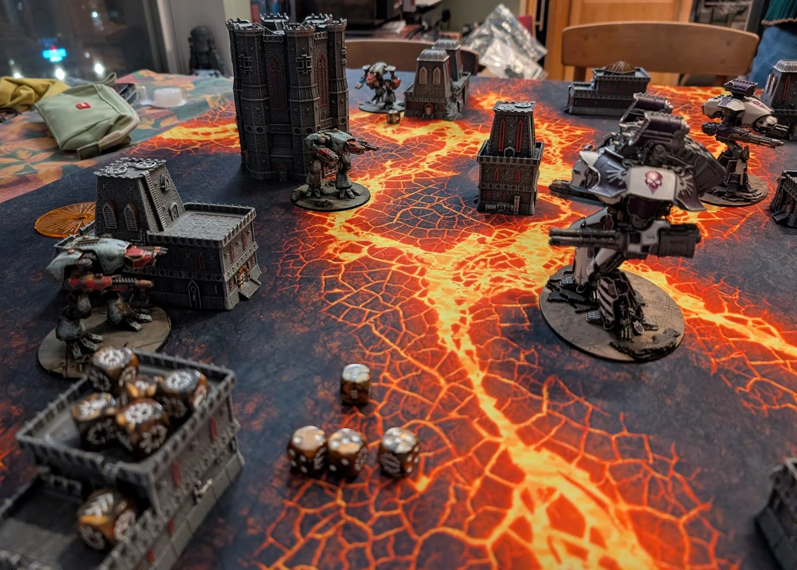
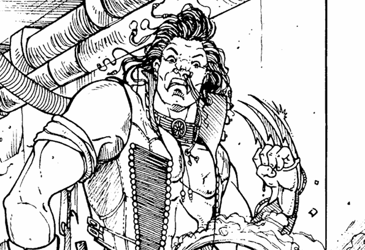
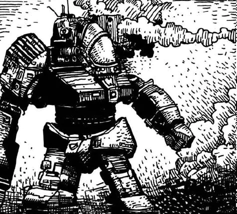
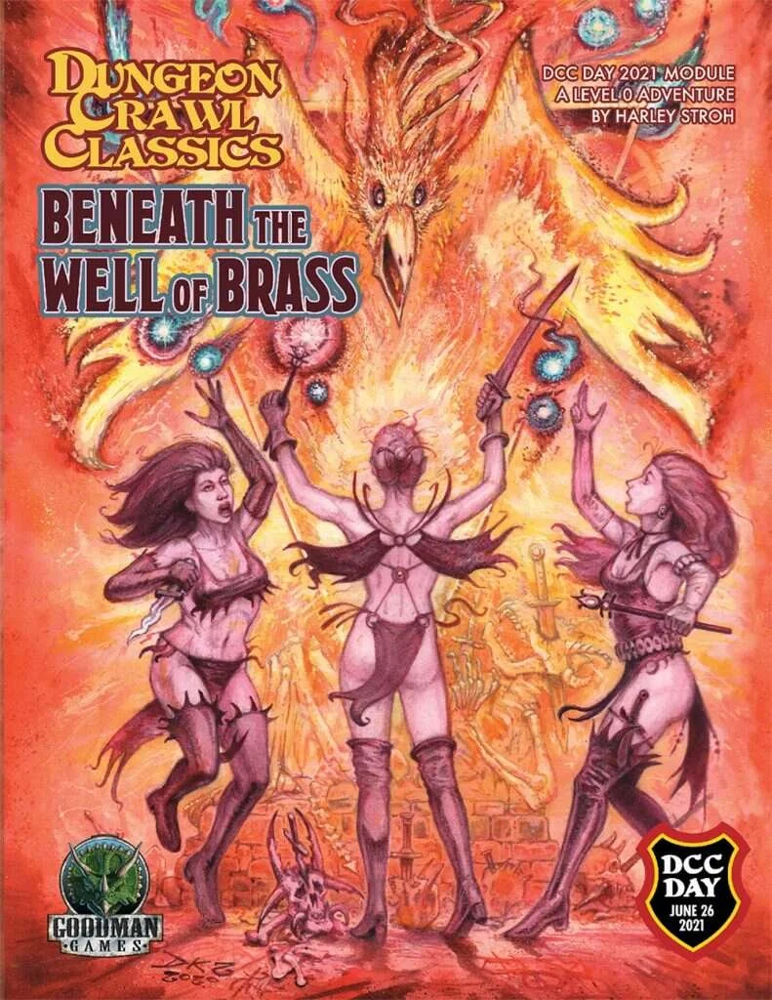
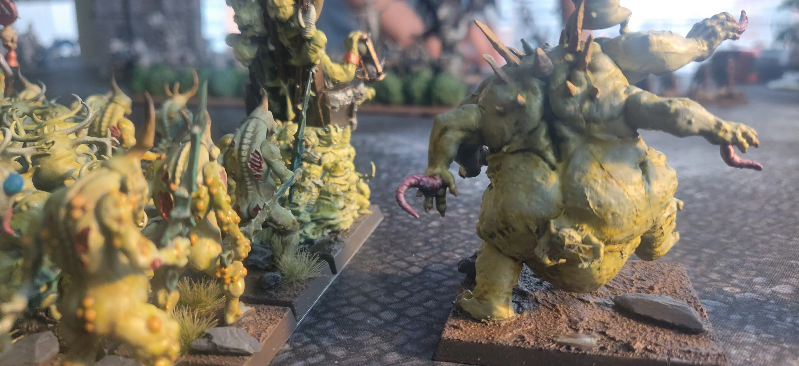
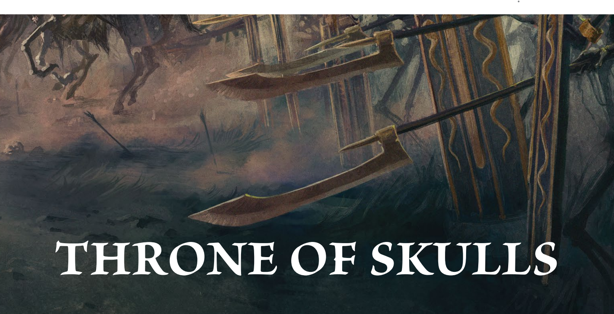
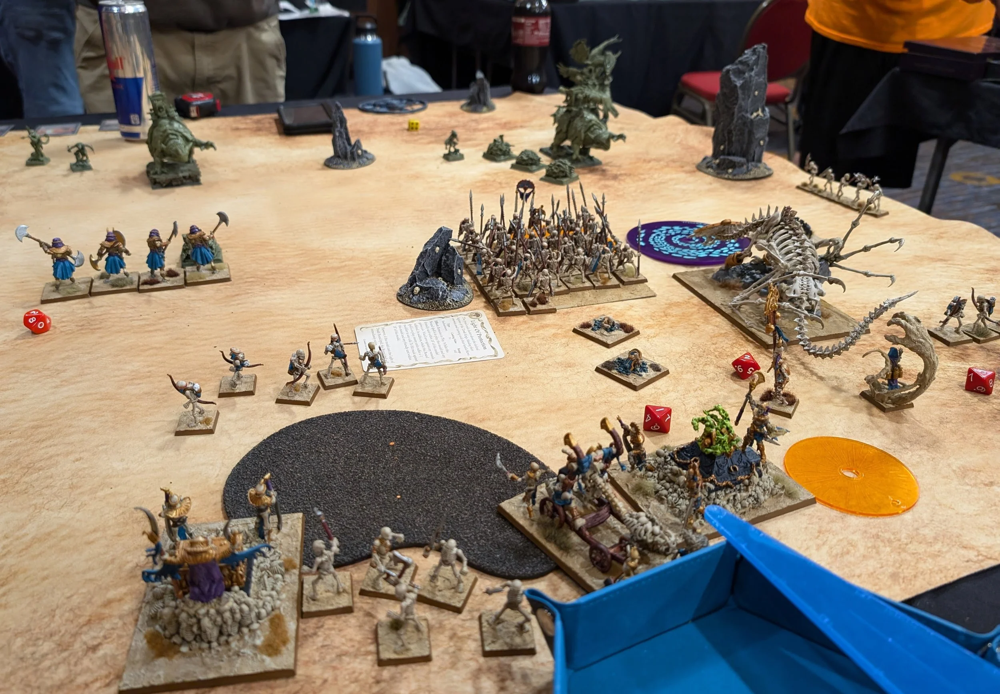
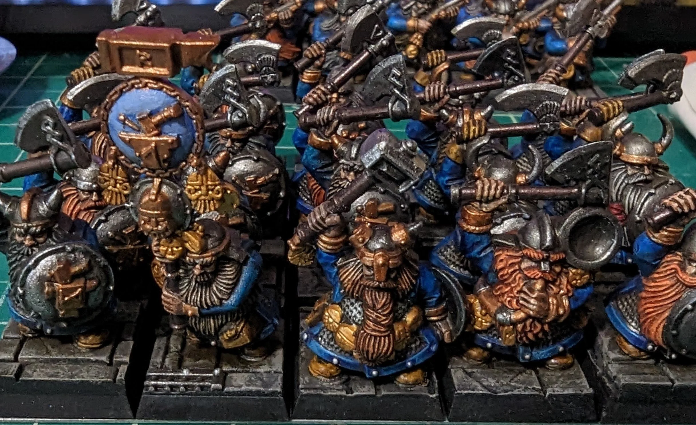
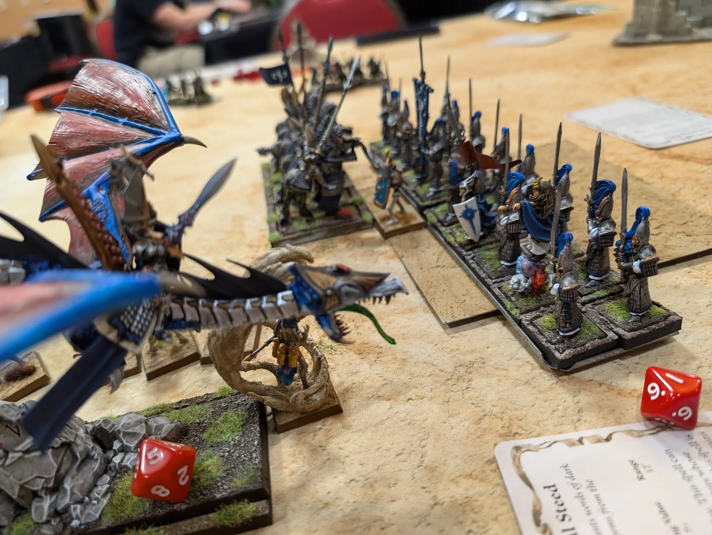

[month-in-gaming](/blog/category/month-in-gaming)
Tim
3/1/26

[month-in-gaming](/blog/category/month-in-gaming)
Tim
3/1/26

# [February 2026 in Gaming](/blog/february-2026-in-gaming)

Trail of Cuthulu, 8mm gaming, and several RPGs where my character can't speak English.

[Read More](/blog/february-2026-in-gaming)

[month-in-gaming](/blog/category/month-in-gaming)
Tim
2/1/26

[month-in-gaming](/blog/category/month-in-gaming)
Tim
2/1/26

# [January 2026 in Gaming](/blog/january-2026-in-gaming)

Dungeon Crawl Classics, Cyberpunk 2020, and some books.

[Read More](/blog/january-2026-in-gaming)

[first-impressions](/blog/category/first-impressions), 
[wargames](/blog/category/wargames)
Tim
9/4/25

[first-impressions](/blog/category/first-impressions), 
[wargames](/blog/category/wargames)
Tim
9/4/25

# [Space Gits First Impressions](/blog/space-gits-first-impressions)

First impressions of Space Gits after painting some models and a handful of games.

[Read More](/blog/space-gits-first-impressions)

[rpg](/blog/category/rpg)
Tim
9/4/25

[rpg](/blog/category/rpg)
Tim
9/4/25

# [What Should RPG Reviews Be?](/blog/what-should-rpg-reviews-be)

Discussing the current state of reviews for tabletop RPGs, how can we improve their content and visibility?

[Read More](/blog/what-should-rpg-reviews-be)

[battletech](/blog/category/battletech)
Tim
4/26/25

[battletech](/blog/category/battletech)
Tim
4/26/25

# [Mechs Catalyst Should Reprint](/blog/mechs-catalyst-should-reprint)

Looking at mechs that Catalyst should include in more ForcePacks and why these mechs deserve another shot.

[Read More](/blog/mechs-catalyst-should-reprint)

[rpg](/blog/category/rpg), 
[dcc](/blog/category/dcc)
Tim
4/17/25

[rpg](/blog/category/rpg), 
[dcc](/blog/category/dcc)
Tim
4/17/25

# [RPGs at Awesome Con Part 2 - DCC & Con Thoughts](/blog/rpgs-at-awesome-con-part-2-dcc-amp-con-thoughts)

A session review and thoughts on the DCC module: Beneath the Well of Brass after running it at Awesome Con in Washington, DC.

[Read More](/blog/rpgs-at-awesome-con-part-2-dcc-amp-con-thoughts)

[rpg](/blog/category/rpg), 
[star wars](/blog/category/star+wars)
Tim
4/13/25

[rpg](/blog/category/rpg), 
[star wars](/blog/category/star+wars)
Tim
4/13/25

# [Running RPGs at Awesome Con(Part 1)](/blog/running-rpgs-at-awesome-con-2025-part-1)

Part 1 of reviewing my experience running RPGs at Awesome Con in Washington, DC. Covering a Star Wars: Age of Rebellion game and one of Eat the Reich.

[Read More](/blog/running-rpgs-at-awesome-con-2025-part-1)

[Old World](/blog/category/Old+World), 
[Reviews](/blog/category/Reviews)
Tim
12/17/24

[Old World](/blog/category/Old+World), 
[Reviews](/blog/category/Reviews)
Tim
12/17/24

# [Empire Arcane Journal Review](/blog/empire-arcane-journal-review)

Overview of new Arcane Journal for Empire in The Old World covering new magic items, units, and the armies of infamy.

[Read More](/blog/empire-arcane-journal-review)

[Travel](/blog/category/Travel), 
[Guides](/blog/category/Guides)
Tim
12/2/24

[Travel](/blog/category/Travel), 
[Guides](/blog/category/Guides)
Tim
12/2/24

# [A Wargamer's Guide to Visiting Tokyo](/blog/a-wargamer-in-tokyo)

A guide to wargaming fans and hobbyists visiting Tokyo. Covers sites to see and shopping for models and hobby supplies.

[Read More](/blog/a-wargamer-in-tokyo)

[Old World](/blog/category/Old+World), 
[Metawatch](/blog/category/Metawatch)
Tim
11/11/24

[Old World](/blog/category/Old+World), 
[Metawatch](/blog/category/Metawatch)
Tim
11/11/24

# [SBOT 2 Metagame Part 4 - Legacy Armies](/blog/sbot-2-metagame-part-4-legacy-armies)

Final metagame review of the SBOT2 looking at legacy army lists.

[Read More](/blog/sbot-2-metagame-part-4-legacy-armies)

[Old World](/blog/category/Old+World)
Tim
11/1/24

[Old World](/blog/category/Old+World)
Tim
11/1/24

# [Warhammer World Old World Event Packet Hot Takes](/blog/warhammer-world-old-world-event-packet-hot-takes)

[Read More](/blog/warhammer-world-old-world-event-packet-hot-takes)

Tim
10/30/24

Tim
10/30/24

# [Battle at the Beltway Old World Tournament Report](/blog/battle-at-the-beltway-tournament-report-2024)

[Read More](/blog/battle-at-the-beltway-tournament-report-2024)

[Old World](/blog/category/Old+World), 
[Metawatch](/blog/category/Metawatch)
Tim
10/30/24

[Old World](/blog/category/Old+World), 
[Metawatch](/blog/category/Metawatch)
Tim
10/30/24

# [SBOT 2 Metagame Part 3 - Ravaging Hordes](/blog/sbot-2-metagame-part-3-ravening-hordes)

[Read More](/blog/sbot-2-metagame-part-3-ravening-hordes)

[Old World](/blog/category/Old+World), 
[Metawatch](/blog/category/Metawatch)
Tim
10/25/24

[Old World](/blog/category/Old+World), 
[Metawatch](/blog/category/Metawatch)
Tim
10/25/24

# [SBOT 2 Metagame Part 2 - Forces of Fantasy](/blog/sbot-2-metagame-part-2-forces-of-fantasy)

[Read More](/blog/sbot-2-metagame-part-2-forces-of-fantasy)

[Old World](/blog/category/Old+World), 
[Metawatch](/blog/category/Metawatch)
Tim
10/24/24

[Old World](/blog/category/Old+World), 
[Metawatch](/blog/category/Metawatch)
Tim
10/24/24

# [SBOT 2 Metagame Part 1 - Overview](/blog/sbot-2-list-review-part-1)

[Read More](/blog/sbot-2-list-review-part-1)

[Old World](/blog/category/Old+World), 
[Metawatch](/blog/category/Metawatch)
Tim
10/24/24

[Old World](/blog/category/Old+World), 
[Metawatch](/blog/category/Metawatch)
Tim
10/24/24

# [Old World Metawatch - Triple GTs](/blog/old-world-meta-watch-24-10-24)

[Read More](/blog/old-world-meta-watch-24-10-24)
