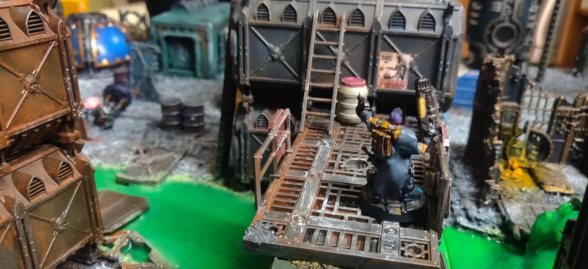
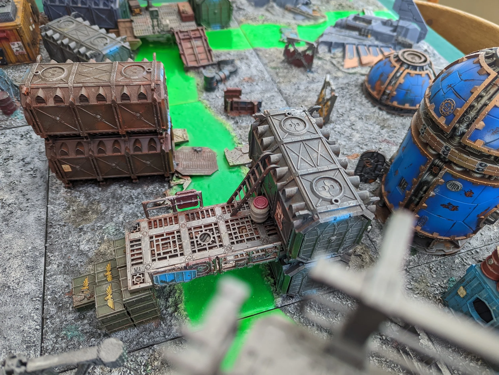

## Toxic Rivers

## Toxic Rivers

These rules are presented as an option for players who have rivers in their terrain collection and want to spice up the battlefield. They will add some complexity but have been very fun in games I've played with them. These rules can represent any number of waterways be they industrial runoff, toxic waste, or even those found in a massive Corpse Grinder facility.

**Sump Currents:** Before the battle players should also designate a direction in which the river flows.

**Falling In:** Any time a fighter falls into the river they lose their active token if they had one and if it was their turn, it ends immediately after resolving these rules. Additionally, remove any conditions the fighter had. Once this has been done, roll on the **Toxic River Table** below.If a fighter is seriously injured when they fall in they go out of action.

**Toxic Recovery:** Any time these rules direct a fighter to go out of action they should roll on the Toxic Recovery table below rather than the Lasting Injury table.

**Washed Downstream:** Any time a fighter is washed downstream, determine the distance they will move. If the random distance moved was odd they appear on the same side of the river. If even they appear on the opposite bank. In both cases the model moves in the direction of the **Sump Currents.** The model's owner then places it, pinned on the river bank within 1" of the distance in question. If this would move a model off the table treat them as out of action and roll on the Toxic Recovery table.  
If there is a suitable bridge or other crossing of the river that is not higher than the bank, models may be placed on it if within 1" of their destination.

**Placing Models:** Models cannot be placed within 1" of enemy models, or on top of any terrain. If it is impossible to place the model, keep moving it downstream on the same bank until it is legal.

## **Toxic River Table**

**11-16: Stuck under-** leave the model face down in the river, they may not be targeted or interacted with in any way, they count as seriously injured for bottle tests. At the end of the turn after serious injury checks have been made, roll again on this table for the fighter.  
**21-46: Lost in the goo-** the fighter is out of action.  
**51-53: Washed downstream-** the fighter is washed 1d3+3" downstream.  
**54-56: Strong currents**- the fighter is washed 1d6+3" downstream.  
**61: Strange currents**- the fighter is washed 1d3+3" upstream, follow the normal directions but they move against the current.  
**62: Strong swimmer**- the fighter may be placed, pinned on a bank within 6" of where they fell in. They may not be placed on terrain or within 1" of an enemy fighter.  
**63: Taking a shortcut**- place the fighter, pinned on the bank opposite of where they entered the river.  
**64: Something shiny**- roll on the **River Loot Table**.  
**65: Mutation**- the fighter is washed d6+3" downstream, roll on the **Mutation table** below.   
**66: Heroic effort**- the fighter is returned to the bank as close to the point where they fell in. They are standing, gain a ready marker, and gain 1XP for this feat.

## **River Loot Table**

1: Fighting Knife  
2: Autopistol  
3: Lasgun  
4: Frag Grenades  
5: Photo Goggles  
6: Opulent Jewelry

[PDF Download](https://drive.google.com/file/d/17eLL2FbfKhfBBR9ka_pRxVCBaot-AtBT/view?usp=sharing)

## **Toxic Recovery Table**

**11: Industrial lesson:** The fighter enters recovery. +D3 XP  
**12-16: Struggle out:** No effect  
**21-43: Coughing up blood and goo:** Into recovery  
**44-46: Rad-sick:** -1T  
**51: Hair loss:** the fighter has lost all hair, -1 Ld and Cl  
**52: Brain damage:** the fighter never quite recovers,  -1 Int and Wil  
**53: Webbed fingers:** the new skin growth makes fine motor control difficult, -1 BS  
**54: Shortened leg:** the fight came out slightly lopsided, -1 movement  
**55: Atrophied muscles:** -1S  
**56: Melted gear:** a random item the ganger had melts into the goo never to be seen again. No other effects.  
**61-65: Mutation:** the fighter is dead unless healed by a doc. If they survive, roll on the mutation chart.  
**66: Stronger than ever:** roll on the mutation chart

## **Mutation Table**

**1: Smelly hand -** whatever you do, you can't wash this unnatural stink off. -1 Ld, gain the *Fearsome* skill.  
**2: Horns** - Unarmed attacks gain +1 Attack, +1 Strength, Damage 2, and -1 AP.  
**3: Rippling muscles** - the fighter gains the *Bull Charge* skill  
**4: Undulating skin** - the fighter gains +1 to their save roles  
**5: Third eye** - +1 BS, +1 Initiative  
**6: Extra arm** - emerging from the goo with another limb this fighter gains the Extra Arm rules per the Genestealer Cult rules
