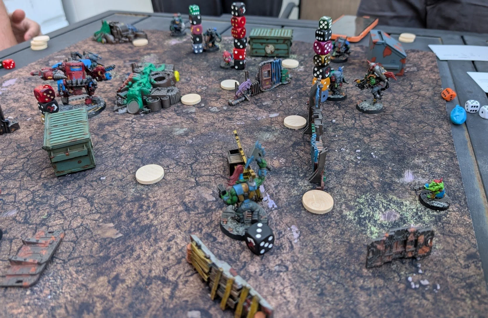

[month-in-gaming](/blog/category/month-in-gaming)
Tim
3/1/26

[month-in-gaming](/blog/category/month-in-gaming)
Tim
3/1/26

# [February 2026 in Gaming](/blog/february-2026-in-gaming)

Trail of Cuthulu, 8mm gaming, and several RPGs where my character can't speak English.

[Read More](/blog/february-2026-in-gaming)

[month-in-gaming](/blog/category/month-in-gaming)
Tim
2/1/26

[month-in-gaming](/blog/category/month-in-gaming)
Tim
2/1/26

# [January 2026 in Gaming](/blog/january-2026-in-gaming)

Dungeon Crawl Classics, Cyberpunk 2020, and some books.

[Read More](/blog/january-2026-in-gaming)

[first-impressions](/blog/category/first-impressions), 
[wargames](/blog/category/wargames)
Tim
9/4/25

[first-impressions](/blog/category/first-impressions), 
[wargames](/blog/category/wargames)
Tim
9/4/25

# [Space Gits First Impressions](/blog/space-gits-first-impressions)

First impressions of Space Gits after painting some models and a handful of games.

[Read More](/blog/space-gits-first-impressions)
